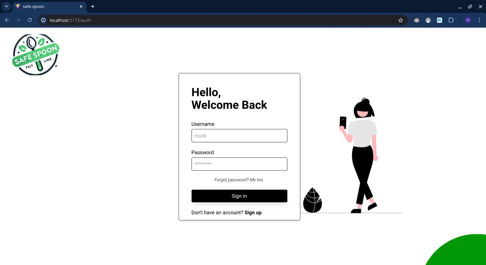
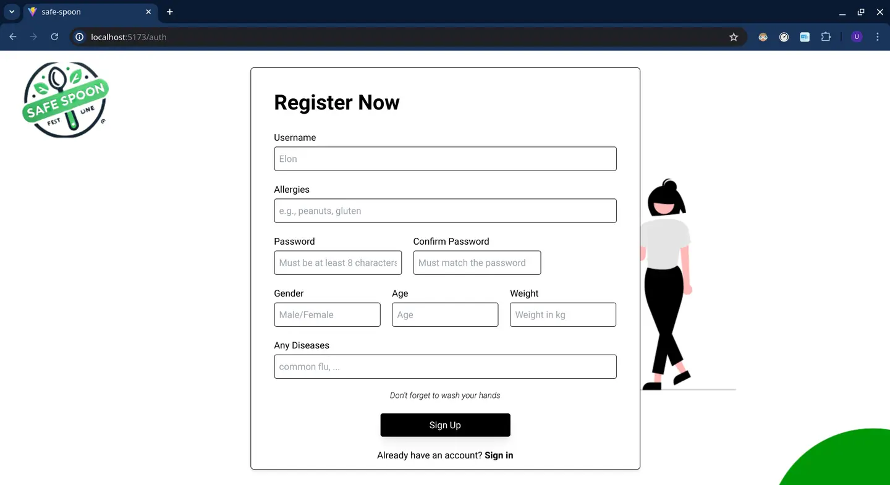
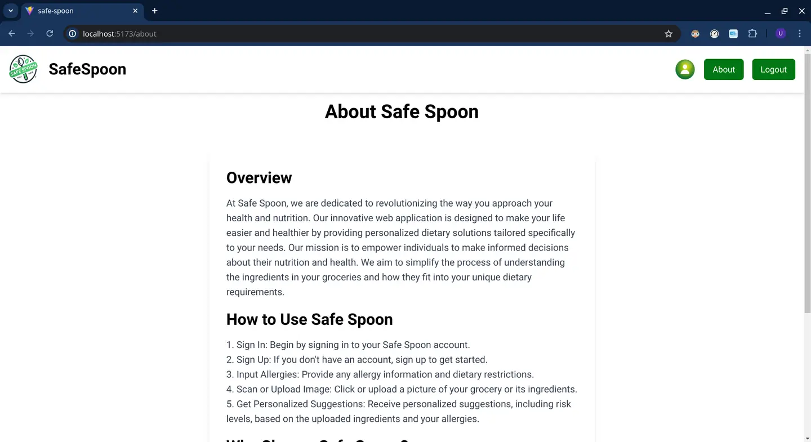
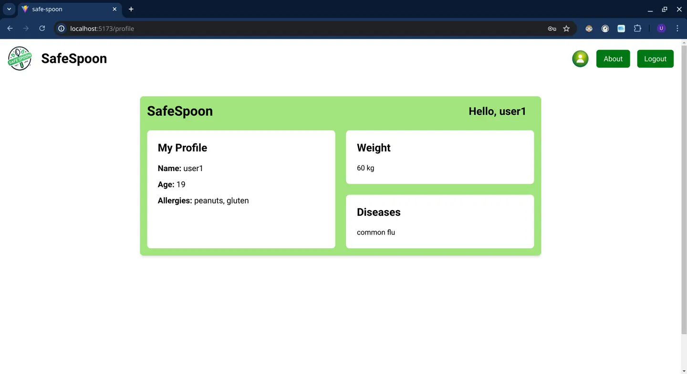
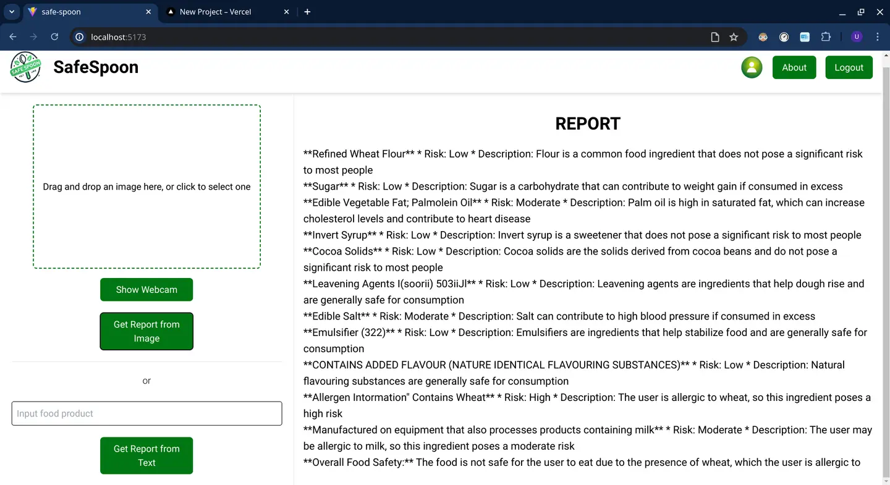

# Safe Spoon
Your personal food safety companion.

- client - https://github.com/uttamkn/safeSpoon-client
- backend - https://github.com/uttamkn/safeSpoon-server

## Project Overview

SafeSpoon is a web-based application designed to help users identify potential allergens in food products. By utilizing advanced technologies such as image recognition and personalized health risk analysis, SafeSpoon ensures that users with food allergies can make informed dietary choices. Whether through scanning an image of the ingredients list or manual input, SafeSpoon provides real-time alerts to help avoid allergenic food items.

#   Screenshots

## Features

- **Allergen Identification:** Users can upload a photo of the ingredients list, and SafeSpoon will analyze it for potential allergens.
- **Manual Input:** If the image processing fails, users can manually enter the ingredients for analysis.
- **Personalized Health Risk Analysis:** Based on a user’s allergy profile, SafeSpoon provides detailed reports on the safety of the food product.
- **Real-Time Alerts:** Immediate feedback on allergens detected in the food items, helping prevent allergic reactions.
## Problem Addressed

Food allergies affect millions of people worldwide. Decoding ingredient lists can be confusing due to non-standardized labels and various terminologies for common allergens. SafeSpoon simplifies this process by automating allergen identification, reducing the risk of accidental allergen exposure.

## Technologies Used

- **Frontend:**
  - JavaScript
 - React.js
 - Tailwind CSS
- **Backend:**
 - Node.js
 - Express.js
 - TypeScript
- **Machine Learning:**
 - Python
 - OpenCV
 - EasyOCR
 - Gemini (API Integration)
   
## How SafeSpoon Works

1. **Upload Image:** Users snap a photo of the food item's ingredients list.
2. **Image Processing:** The image is analyzed using EasyOCR to extract text.
3. **Allergen Analysis:** The extracted text is cross-referenced with the user’s allergy profile to flag potential allergens.
4. **Report Generation:** A detailed report is provided, highlighting any risky ingredients.
   
If the image can't be processed, users can manually input the ingredients for analysis.

## Contribution

Feel free to fork, clone, and contribute to the project via pull requests.
